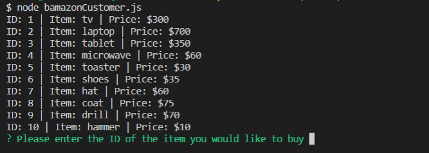
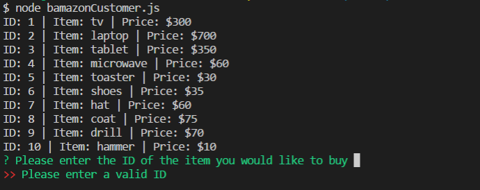
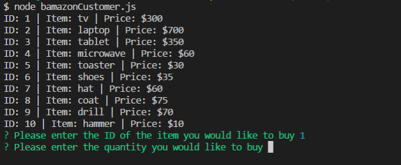
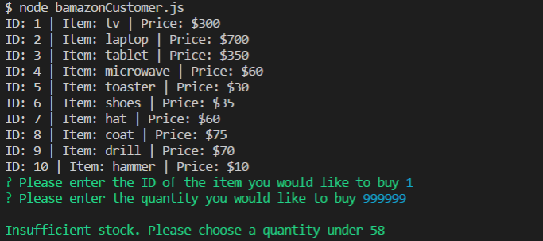
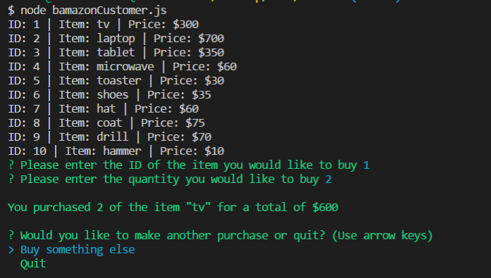
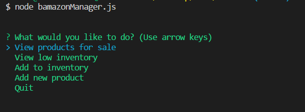
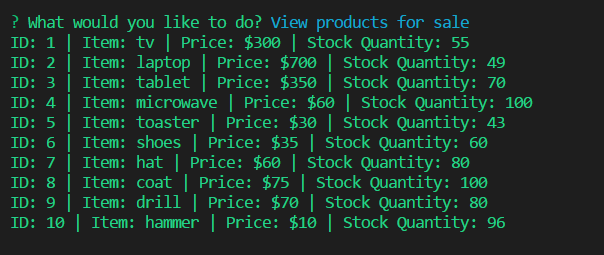

# Bamazon

Bamazon is an app for managing product stock and customer orders. It can display available products, complete customer requests, and deplete the item stock in the products database. 

# Customer app

When a customer starts the app, they are provided with a list of all products in the database. They are prompted to enter the ID of the product they want to purchase.



## Validation
If the customer enters a number that is not a product ID, they are prompted to enter a valid ID.



Then they are prompted for how many of that product they'd like to purchase.



## Validation
If the customer requests a quantity higher than what is available in stock, they will be informed of the current number available from the database and prompted to enter a new quantity.



Once a valid ID and quantity have been entered, the customer will be provided with a confirmation of the item they purchased, the quantity, and the total price. They have the option to buy something else or quit.



The database is also updated to reflect the new quantity of that item in stock.
```javascript
// Update database with new quantity
connection.query(
    "UPDATE products SET ? WHERE ?",
    [
        {
            stock_quantity: item.stock_quantity - purchaseQuantity
        },
        {
            id: item.id
        }
    ]
);
```

# Manager app

When a manager starts the app, they are provided with a list of options



## View products for sale

This displays information for all items in the database



## Additional functionality coming soon!